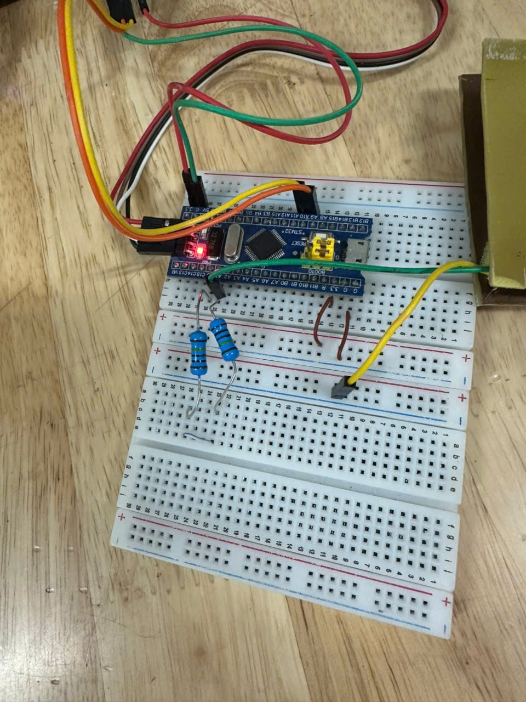
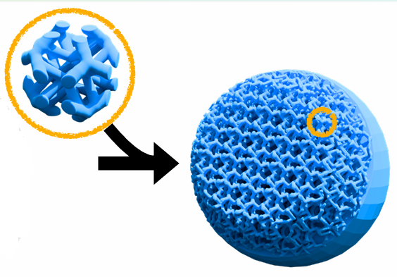
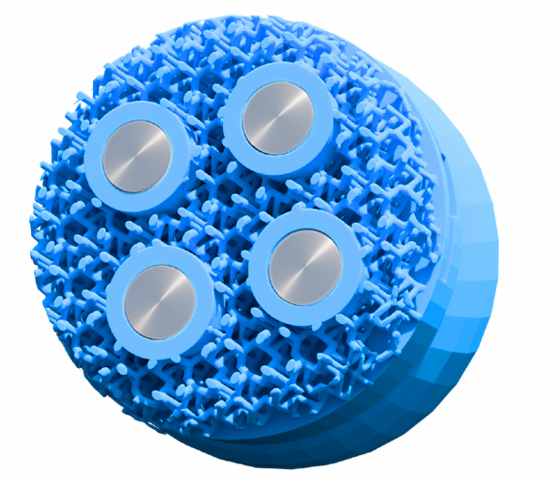
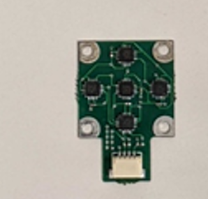
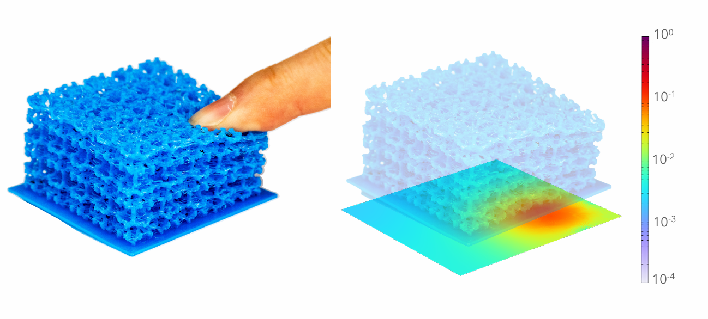

# Báo cáo tiến độ nghiên cứu ngày 11/04/2026
## A. Công việc đã làm
- Nghiên cứu cảm biến xúc giác điện dung
- Thực hành các thí nghiệm đo dữ liệu cảm biến
- Nghiên cứu cảm biến xúc giác từ tính
## B. Khó Khăn
- Tính lực bằng neural network
## C. Báo cáo chi tiết
### 1. Nghiên cứu cảm biến xúc giác điện dung
#### a. Cấu trúc phần cứng
- 2 miếng PCB đặt song song như 2 bản tụ và 1 lớp điện môi đàn hồi.
- Lớp điện môi đàn hồi, dễ nén khi chịu lực, cho phép khoảng cách giữa hai bản cực thay đổi theo lực tác động.
#### b. Nguyên lí điện dung
- Khi có lực tác động, lớp điện môi đàn hồi sẽ biến dạng làm cho 2 bản tụ gần nhau hơn khiến điện dung tăng.

$$
C = \frac{\varepsilon S}{d}
$$
#### c. Thực hành thí nghiệm đo dữ liệu cảm biến điện dung
- Phương pháp đo được sử dụng là đo thời gian nạp của mạch RC. Cảm biến điện dung được xem như một tụ điện biến thiên. STM32 trước tiên xả tụ, sau đó cho tụ nạp qua một điện trở cố định và dùng timer để đo khoảng thời gian từ lúc bắt đầu nạp đến khi điện áp trên tụ đạt ngưỡng logic HIGH của chân vào. Do thời gian nạp tỉ lệ với tích RC, khi lực tác động làm điện dung thay đổi thì thời gian đo được cũng thay đổi tương ứng. Từ giá trị thời gian này có thể đánh giá mức biến thiên điện dung của cảm biến.

##### Linh kiện sử dụng:
- Stm32f103c8t6
- Trở : 2M

#### d. Thí nghiệm đo điện dung C với các vật liệu và kích thước khác nhau
Thông số thí nghiệm: https://docs.google.com/spreadsheets/d/1oDMeJInywCcWdUgZgRkDI_ojWt-54ljqLPaGA13Ekbc/edit?gid=211544715#gid=211544715

#### e. Cách tính lực của cảm biến
##### Thu thập dữ liệu
- Tác động các mức lực chuẩn khác nhau lên cảm biến.
- Đo và ghi lại giá trị điện dung tương ứng của cảm biến.
- Tạo tập dữ liệu gồm các cặp giá trị (điện dung C, lực F).
##### Xây dựng dữ liệu huấn luyện
- Điện dung đo được từ cảm biến được sử dụng làm đầu vào (input) của mạng nơ-ron.
- Lực tác động thực tế được sử dụng làm đầu ra (output) của mạng.
##### Thiết kế mô hình mạng nơ-ron
Sử dụng mạng nơ-ron truyền thẳng nhiều lớp (MLP).
Cấu trúc gồm:
- lớp đầu vào: giá trị điện dung hoặc tần số đo được
- lớp ẩn: học mối quan hệ phi tuyến
- lớp đầu ra: giá trị lực dự đoán.
##### Huấn luyện mạng nơ-ron
- Dữ liệu thu thập được được dùng để huấn luyện mạng.
- Mạng điều chỉnh các trọng số để giảm sai số giữa lực dự đoán và lực thực tế.
##### Sử dụng mô hình để dự đoán lực
- Khi hệ thống hoạt động, điện dung đo được từ cảm biến được đưa vào mạng nơ-ron.
- Mạng nơ-ron sẽ tính toán và xuất ra giá trị lực tương ứng.
### 2. Nghiên cứu cảm biến xúc giác từ tính
#### a. Cấu trúc phần cứng
- Lớp vỏ cảm nhận cơ học: Sử dụng mạng lưới vi cấu trúc (cut-cell microstructures) kết hợp công cụ mã nguồn mở, cho phép tùy biến linh hoạt kích thước ô lưới, độ dày dầm và cấu hình phân tầng độ cứng.

- Hệ thống phát tín hiệu từ tính: Gồm các nam châm được đặt trực tiếp vào các túi chứa bên trong lưới. Các nam châm này được sắp xếp phân cực xen kẽ nhằm triệt tiêu nhiễu từ trường.

Link tham khảo cấu trúc vi mô phần cứng:https://github.com/notvenky/eFlesh/tree/main/microstructure

- Hệ thống thu thập tín hiệu : Tích hợp bảng mạch từ kế chứa các cảm biến Hall, được đặt trong một khe cắm chuyên dụng ở phần đế để trực tiếp đo lường sự biến thiên từ trường.

Link tham khảo cảm biến từ kế:https://github.com/raunaqbhirangi/reskin_sensor/tree/main/circuits

Giá thành đặt khoảng 15 đô.

#### b. Cơ chế tạo và thu nhận tín hiệu từ tính
- Nguyên lý: Khi có ngoại lực làm biến dạng bề mặt cảm biến, các nam châm bên trong sẽ bị xê dịch, kéo theo sự thay đổi của từ trường xung quanh.
- Thu nhận: Sự biến thiên từ trường này được đo lường trực tiếp bởi các cảm biến hiệu ứng Hall được đặt bên trong hoặc bên dưới mạng lưới.
- Tín hiệu đầu ra: Tín hiệu này được hệ thống xuất ra dưới dạng một vector 15 chiều(do có 5 cảm biến từ kế 3 trục) đại diện cho sự thay đổi của từ trường.

#### c. Cách tính toán và suy ra lực
- Bước 1: Chuyển đổi lực thành sự nhiễu loạn từ tính: Khi có lực tác động lên bề mặt, lớp vi cấu trúc nhựa in 3D sẽ bị lún hoặc lệch, kéo theo sự xê dịch vị trí của các nam châm bên trong. Sự xê dịch vật lý này trực tiếp làm thay đổi từ trường xung quanh
- Bước 2: Số hóa thành tín hiệu 15 chiều: Bảng mạch từ kế chứa 5 cảm biến hiệu ứng Hall đặt bên dưới sẽ lập tức đo lường sự biến thiên từ thông này theo 3 trục (X, Y, Z). Các giá trị này được gộp lại thành một dải dữ liệu thô, gọi là vector 15 chiều.
- Bước 3: Dùng AI (mạng MLP) để tính lực: Thay vì đưa vào các phương trình phức tạp, vector 15 chiều này được nạp thẳng vào một mạng nơ-ron đa tầng (MLP) siêu nhẹ. Mạng này chỉ có 2 lớp ẩn, mỗi lớp chứa 128 nơ-ron và sử dụng hàm kích hoạt ReLU. Mạng MLP sẽ đóng vai trò tính toán, ánh xạ (mapping) trực tiếp sự thay đổi hỗn độn của từ trường thành các con số cụ thể về Lực pháp tuyến (lực ép vuông góc) và Lực cắt (lực trượt ngang) với đơn vị là Newton (N)

Bài báo tham khảo:https://arxiv.org/pdf/2506.09994

